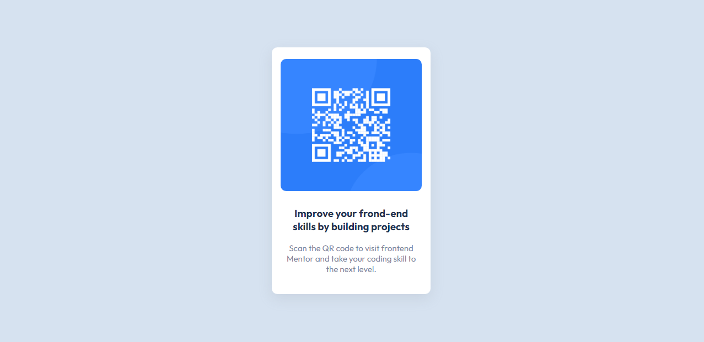

# Frontend Mentor - QR code component solution

This is a solution to the [QR code component challenge on Frontend Mentor](https://www.frontendmentor.io/challenges/qr-code-component-iux_sIO_H). Frontend Mentor challenges help you improve your coding skills by building realistic projects. 

## Table of contents

- [Overview](#overview)
  - [Screenshot](#screenshot)
  - [Links](#links)
- [My process](#my-process)
  - [Built with](#built-with)
  - [What I learned](#what-i-learned)
- [Author](#author)

## Overview

### Screenshot



### Links

- Solution URL: [Add solution URL here](https://your-solution-url.com)
- Live Site URL: [Add live site URL here](https://your-live-site-url.com)

## My process

### Built with

- Semantic HTML5 markup
- CSS custom properties
- Flexbox
- CSS Grid

### What I learned

I learned about google fonts, css imports, and how to put a tab icon.

```html
  <link rel="icon" type="image/png" sizes="32x32" href="./images/favicon-32x32.png">
```
```css
  @import url('https://fonts.googleapis.com/css2?family=Outfit:wght@400;700&display=swap');
```
## Author

- Website - [Aaron Maraya](https://frontend-mentor-qr-scan.netlify.app/)
- Frontend Mentor - [@aaronmarayaa](https://frontendmentor.io/profile/aaronmarayaa)
- Twitter - [@aaronmarya](https://twitter.com/aaronmaraya)
